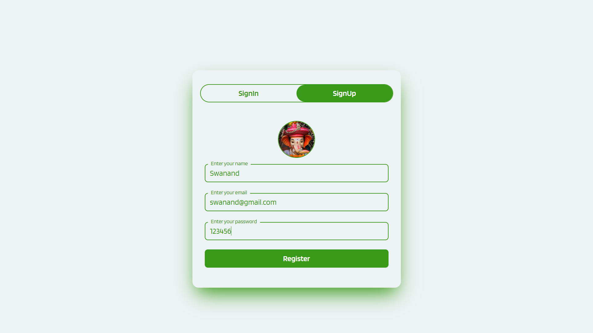
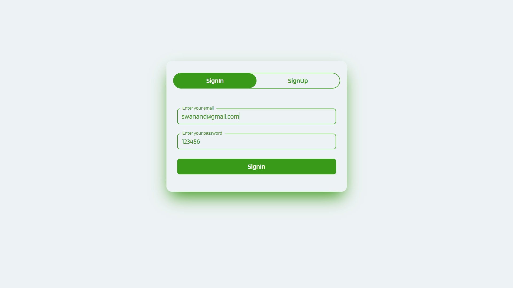
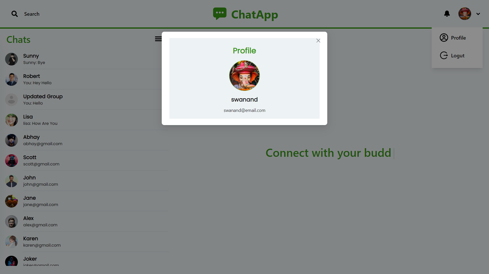
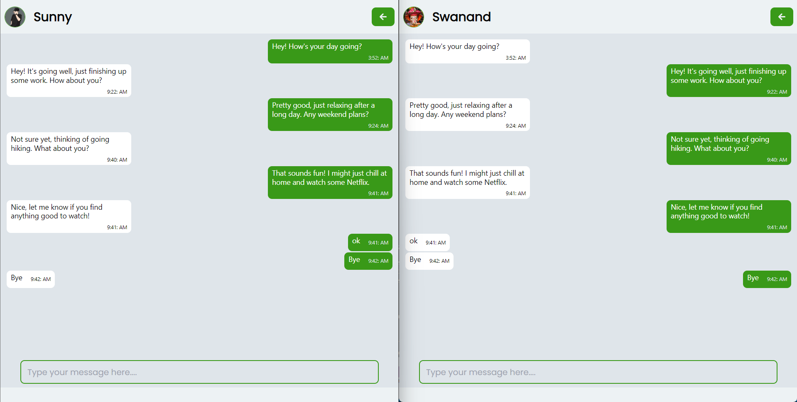
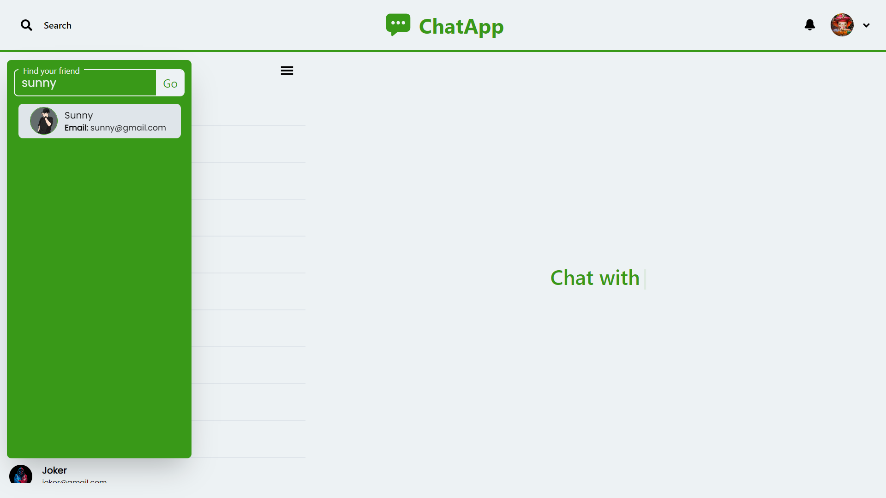
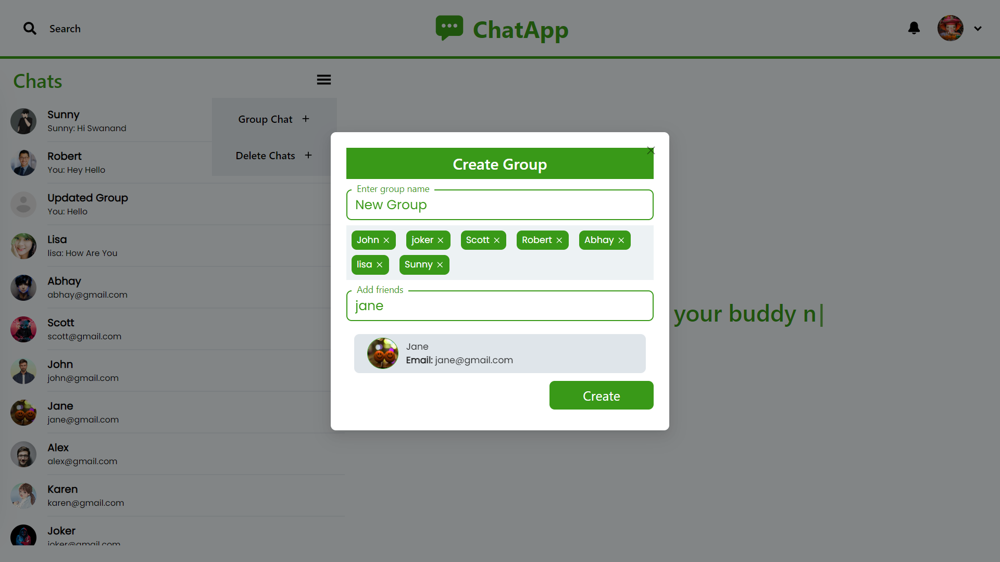
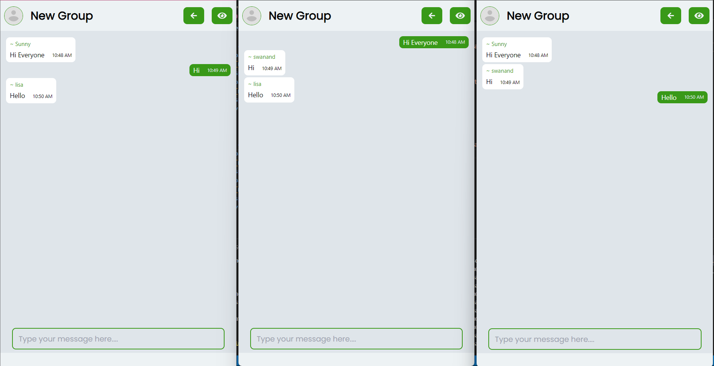
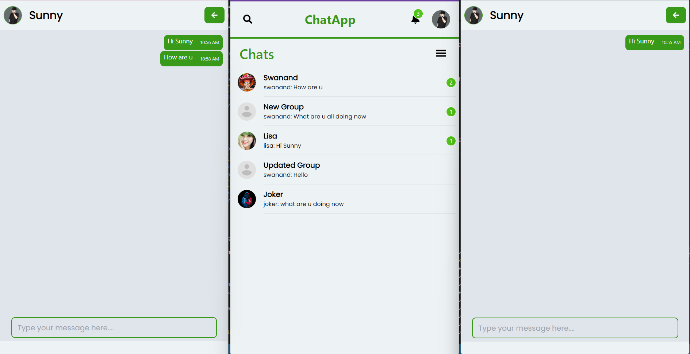
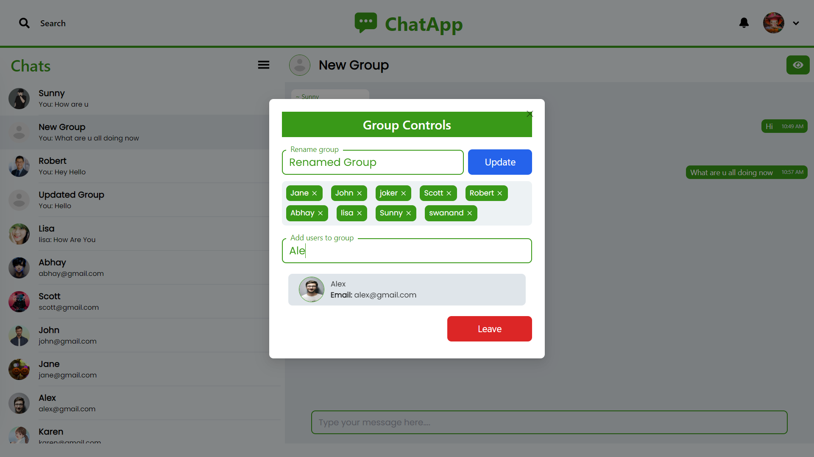
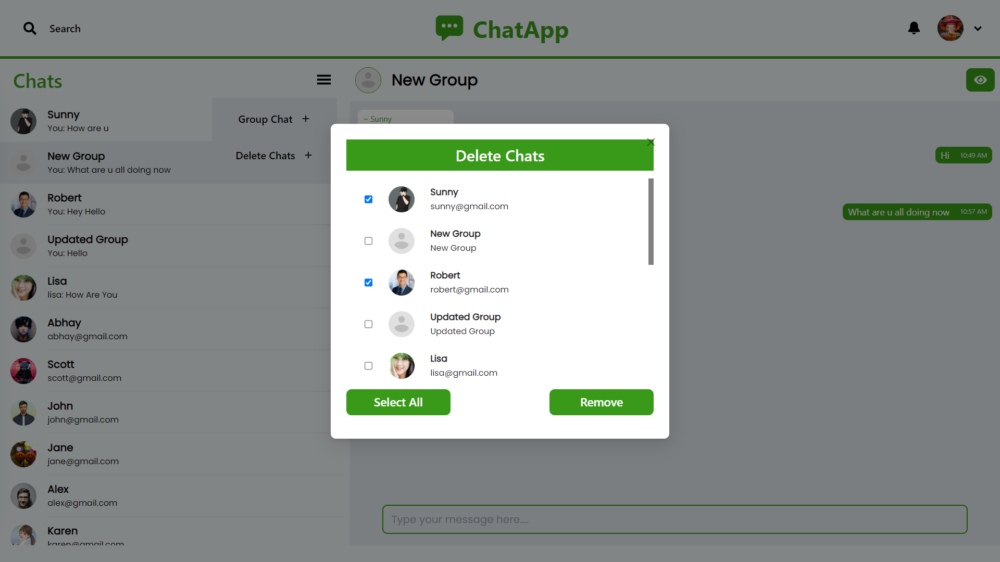

# Chat-App
Chat-App is a Full Stack Chatting App. Uses Socket.io for real time communication and stores user details in encrypted format in Mongo DB Database.
## Live Demo
A live demo of the application is hosted at [https://chat-app-1-tutj.onrender.com](https://chat-app-1-tutj.onrender.com)


## Built With
- 
## Run Locally
To run this project locally, follow these steps:

1. Clone the repository:
   ```bash
   git clone https://github.com/Swanand12/Chat-App.git

2. Navigate to the project directory:
   ```bash
   cd Chat-App

3. Go to the backend directory:
   ```bash
   cd backend

4. Install backend dependencies and Run the backend server:
   ```bash
   npm install
   npm run server

5. Go to the frontend directory:
   ```bash
   cd frontend

6. Install backend dependencies and Run the App:
   ```bash
   npm install
   npm start

# Features
## Authentication


## View Profile

## One to One Chat

## Real Time Chatting with Typing Indicator

## Search Users

## Create Group Chats

## Group Chat

## Real Time Notifications

## Admin can Rename Group, Remove Users or Add Users 

## User can Delete Chats



